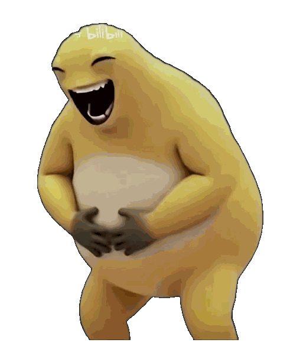

# 🎞️ ClipPet

**视频转透明背景精灵帧动画 — AI Agent Skill**
> 抠帧兽 —— 把视频里的角色抠出来，变成你的动画精灵

> 本 skill 由 AI Agent 按需调用。用户说"视频转帧""抠图""去背景""透明背景动画""逐帧动画""精灵帧""GIF透明""帧对齐"等时自动触发。

---

## 📥 安装到 AI Agent

ClipPet 可以作为 AI Agent Skill 安装到各种 AI 编程工具中，安装后用户提到"抠图""去背景""透明动画""视频转帧"等关键词时会自动触发。

> 本 skill 由 AI Agent 按需调用，不需要每次手动加载。

### OpenCode / Cursor / Windsurf

```bash
# 方式一：克隆到项目本地（推荐，随项目携带，团队共享）
cd your-project
git clone https://github.com/Erkan9527/ClipPet.git .agents/skills/ClipPet

# 方式二：安装到全局技能目录（所有项目可用，推荐个人使用）
git clone https://github.com/Erkan9527/ClipPet.git ~/.config/opencode/skills/ClipPet
```

**注册技能**：在项目根目录创建或编辑 `opencode.json`（或 `opencode.jsonc`）：

```json
{
  "skills": {
    "ClipPet": {
      "description": "视频转透明背景精灵帧动画 — 抽帧→AI抠图→锚定对齐→GIF导出"
    }
  }
}
```

### Claude Code

```bash
# 克隆到 Claude Code 技能目录
git clone https://github.com/Erkan9527/ClipPet.git ~/.claude/skills/ClipPet
```

Claude Code 会自动加载 `~/.claude/skills/` 下的所有技能配置，无需额外注册。

### 手动使用（不依赖 AI Agent）

```bash
# 1. 安装依赖
pip install pillow numpy torch torchvision transformers huggingface_hub

# 2. 三步处理
python scripts/01_extract_frames.py input.mp4 --fps 10 --output frames_raw
python scripts/02_birefnet_matting.py frames_raw --output frames_matted
python scripts/03_animation_tuner.py frames_matted --output frames_tuned --gif output.gif
```

---

## 这是什么

把一段视频变成**透明背景的逐帧动画**。不需要绿幕，不需要手动抠图，三步全自动：

```
任意视频 → ① 拆帧 → ② AI 抠图 → ③ 居中摆正 → 透明 PNG 序列 + GIF
```

产物是画布一致、不会晃动的精灵帧序列，可直接丢进游戏引擎、Flutter、Web 动画、聊天表情包。

---

## 奶娃示范

<p align="center">
  
</p>

拿 **奶娃捧腹大笑原版视频**（14.8 秒，480×552）跑一遍，结果：

| 环节 | 数量 | 说明 |
|------|------|------|
| 原视频 | 1 个 MP4 | 奶娃站在普通背景前大笑，身体在晃 |
| ① 抽帧（10fps） | 148 张 JPG | 每秒拆 10 帧 |
| ② AI 抠图 | 148 张透明 PNG | 奶娃被完整抠出，背景全透明 |
| ③ 居中锚定 | 44 帧对齐 PNG | 每帧奶娃自动居中，抖动消除 |
| 最终 GIF | 1 个透明 GIF | 可直接用的大笑奶娃动图 |

**关键细节**：原始视频里奶娃大笑时身体上下颠，第③步的锚定算法自动把每一帧的奶娃中心对齐到画布中心，出来的 GIF 是稳稳当当的，不会跳来跳去。

---

## 怎么用（AI Agent 指引）

### 触发条件

用户提到以下任意关键词时，调用本 skill：

```
视频转帧 | 视频抽帧 | 抠图 | 去背景 | matting | 透明背景动画
逐帧动画 | spritesheet | 精灵帧 | 帧序列 | GIF透明
动画锚定 | 帧对齐 | 消除抖动 | animation tuner | frame pipeline
```

### 工作流程

```bash
# 1. 先检查环境
ffmpeg -version                    # 缺了就装
python -c "import torch; print('OK')"  # 缺了就 pip install

# 2. 三步处理
python scripts/01_extract_frames.py <视频> --fps 10 --output frames_raw
python scripts/02_birefnet_matting.py frames_raw --output frames_matted
python scripts/03_animation_tuner.py frames_matted --output frames_tuned --gif output.gif
```

### 产出交付

- 透明精灵帧：`tuned_001.png` ~ `tuned_NNN.png`
- 透明 GIF：`output.gif`

给用户看 GIF，问"需要调整帧率或尺寸吗？"

---

## 参数速查

### ① 抽帧 — `01_extract_frames.py`

| 参数 | 默认 | 说明 |
|------|------|------|
| `video` | (必填) | 输入视频路径 |
| `--fps` | `10` | 帧率（越高越流畅，文件越大） |
| `--output` | `./frames` | 输出目录 |

> 自动检测 ffmpeg。没装直接给各平台安装命令。

### ② AI 抠图 — `02_birefnet_matting.py`

| 参数 | 默认 | 说明 |
|------|------|------|
| `input_dir` | (必填) | 原始帧目录 |
| `--output` | `./matted` | 输出目录（RGBA PNG） |
| `--model` | `ZhengPeng7/BiRefNet` | 模型 ID（可换 RMBG 等） |
| `--size` | `1024` | 推理分辨率（显存不够降为 512） |
| `--pattern` | `frame_*.jpg` | 文件名匹配模式 |

**兜底链**：依赖预检 → 模型缓存检测 → HuggingFace 不可达给镜像方案 → CUDA OOM 自动退回 CPU

### ③ 锚定对齐 — `03_animation_tuner.py`

| 参数 | 默认 | 说明 |
|------|------|------|
| `input_dir` | (必填) | 抠图帧目录 |
| `--output` | `./tuned` | 对齐帧输出目录 |
| `--gif` | `./output.gif` | 输出 GIF |
| `--padding` | `30` | 内容到画布边距 |
| `--canvas-w/h` | `0` | 画布尺寸（0=自动） |
| `--duration` | `100` | GIF 每帧毫秒数 |
| `--pattern` | `matted_*.png` | 输入帧模式 |

> 自动模式会扫描所有帧，算出刚好装下全部内容的最小画布。

---

## 帧率与节奏

| 用途 | fps | duration |
|------|-----|----------|
| 待机动效 | 10 | 100ms |
| 快速动作 | 15 | 66ms |
| 慢速卡点 | 6 | 166ms |
| 表情包 | 8 | 125ms |

---

## 常见问题

**Q: 抠图效果不好怎么办？**
试试换模型 `--model briaai/RMBG-2.0`，或者降低 `--size` 到 512 用更保守的推理。

**Q: HuggingFace 连不上？**
```bash
export HF_ENDPOINT=https://hf-mirror.com
```

**Q: GIF 感觉卡卡的？**
原视频帧率可能太低。抽帧时用 `--fps 15` 以上，同时缩短 `--duration`。

**Q: 帧数太多跑不动？**
降低 `--fps` 或少抽几秒。

---

## 产物用途

透明对齐帧可以直接用：

- **Flutter** `Image.asset('tuned_001.png', gaplessPlayback: true)`
- **Web Canvas** `ctx.drawImage(img, x, y)` 逐帧循环
- **游戏引擎** PNG 序列导入为 sprite
- **视频编辑** 导入为透明叠加层
- **聊天** GIF 直接发
